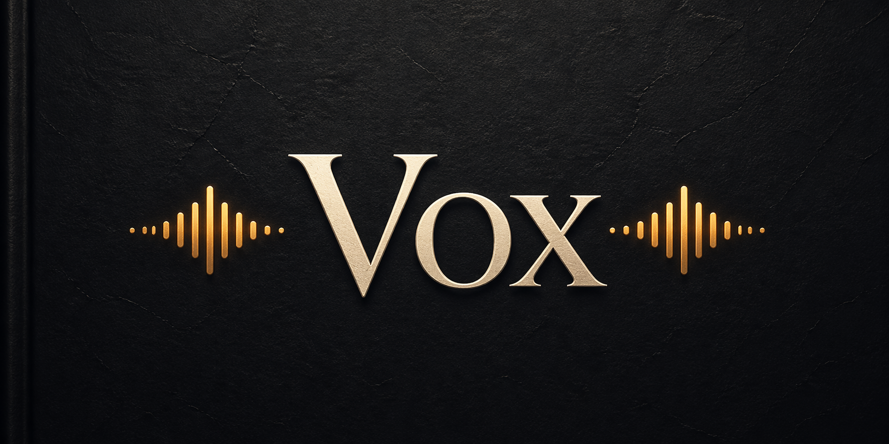

**Vox** reads your Obsidian notes aloud.

Each folder can have its own voice. Hover the sidebar icon to pick one and it starts reading immediately.

Three providers: **ElevenLabs** (best quality), **OpenAI** (solid, easier to start), **Browser** (free, no account needed).

## Highlights

- Read the current note aloud from the sidebar, command palette, popover, or file menu
- Pause, resume, and stop playback without leaving Obsidian
- Choose between ElevenLabs, OpenAI, and the browser's built-in speech synthesis
- Assign default voices globally, per folder, or per note frontmatter
- Hover the sidebar icon to pick a voice and start reading immediately
- Cache generated audio for identical text, voice, model, tone, and speed

## What I use it for

- Hearing book notes in the author's voice
- Reviewing meeting notes or decisions hands-free
- Catching awkward phrasing in my own writing by hearing it read back
- Going through a long research note without staring at a screen
- Assigning a distinct voice to each folder so context shifts feel intentional

## Setup

1. Go to **Settings → Community plugins**, click **Open plugins folder**, drop the plugin folder in (`.obsidian/plugins/vox/`)
2. Enable it under **Settings → Community plugins**
3. Open **Settings → Vox**, pick your provider

## ElevenLabs

The voices sound like people. That's not obvious until you compare them side by side, but once you do it's hard to go back.

### Get your API key

1. Create an account at [elevenlabs.io](https://elevenlabs.io)
2. Profile → API keys → copy your key
3. Paste it into **Settings → Vox → API key**

### Create a voice

ElevenLabs Voice Design lets you generate a voice from a text description. Paste a prompt and generate.

There's a ready-made collection of voice prompts in [`VOICES.md`](./VOICES.md): Epictetus, Tony Robbins, David Attenborough. Start there.

A few things I've noticed:

- Stability 0.5, similarity boost 0.75 is a good starting point
- Try the same prompt with different base voices. The description shapes personality, the base voice shapes timbre

### Add the voice to Vox

1. In ElevenLabs, open the voice → copy the Voice ID
2. In Vox settings → **Voices → Add voice**
3. Give it a name (anything you'll recognise) and paste the Voice ID
4. Click the chip to set it as default

Speed range: 0.7x - 1.2x. ElevenLabs applies it server-side, so quality stays clean.

## OpenAI

Easier to set up. High quality, more neutral character.

1. Get an API key from [platform.openai.com](https://platform.openai.com)
2. Paste it into **Settings → Vox → API key**
3. Pick a voice: `alloy · ash · ballad · cedar · coral · echo · fable · marin · nova · onyx · sage · shimmer · verse`
4. Set a **Tone** if you want: calm, conversational, news anchor, storytelling, energetic

**Models:** `tts-1` is faster and cheaper. `tts-1-hd` sounds noticeably better for long reads. Cost is around $0.015 per 1k characters.

Speed range: 0.25x - 4.0x.

## Browser

Uses your OS's built-in speech synthesis.

1. Switch the provider to **Browser** in Vox settings
2. Optionally set a voice name (`Samantha` or `Alex` on macOS)

Quality depends entirely on your OS. Fine for short reads, not great for anything longer.

Speed range: 0.6x - 2.0x.

## Usage

**Sidebar icon** morphs based on state:

- idle: click to start reading
- playing/paused: click to open playback controls

**Hover the icon** and the Vox popover opens. Pick a voice and it starts reading immediately.

**Playback controls** live in the popover while active: pause/resume, stop, elapsed timer, and speed.

**Command palette:**

- `Vox: Read active note aloud`
- `Vox: Stop reading`
- `Vox: Toggle play / pause`

**File menu:** right-click any `.md` file → `Vox: read aloud`

### Per-folder voices

Go to **Folder voices** in settings. Map a folder prefix to a voice. The longest matching prefix wins, so `Philosophy/Stoics/` beats `Philosophy/` if both match.

### Per-note override

Override the voice for a single note via frontmatter:

```yaml
voice: "nova"
```

Works with any provider. For ElevenLabs, use the voice ID. For OpenAI, use the voice name.

## Development

```bash
npm install
npm run dev
```

```bash
npm run build      # production build
npm run typecheck  # type-check without building
```

For Obsidian development, enable **Settings → Vox → Auto-reload while developing**.
Then run `npm run dev`; Vox reloads itself in Obsidian when `main.js`, `styles.css`, or `manifest.json` changes.
