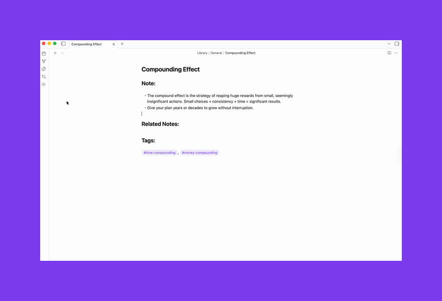

<h1 align="center">Vox</h1>

<p align="center">
  Listen to your notes with your favorite voices.<br /><br />
  
</p>

## Features

- Reads any note aloud with full playback controls (pause, resume, stop)
- Three providers: ElevenLabs, OpenAI, Browser
- Voice assignment: globally, per folder, or per note

## Ideas for how to use it

- Review meeting notes or decisions hands-free while you're away from your desk
- Catch awkward phrasing in your own writing by hearing it read back
- Work through a long research note without staring at a screen
- Proofread in a second language by listening for rhythm and flow rather than reading
- Practice a presentation or speech by listening back to your notes and hearing how it lands

## Setup

1. Go to **Settings → Community plugins**, click **Open plugins folder**, drop the plugin folder in (`.obsidian/plugins/vox-reader/`)
2. Enable it under **Settings → Community plugins**
3. Open **Settings → Vox**, pick your provider

## ElevenLabs

The voices sound like people. That's not obvious until you compare them side by side, but once you do it's hard to go back.

### Get your API key

1. Create an account at [elevenlabs.io](https://elevenlabs.io)
2. Profile → API keys → copy your key
3. Paste it into **Settings → Vox → API key**

### Create a voice

ElevenLabs Voice Design lets you generate a voice from a text description. Paste a prompt and generate.

There's a ready-made collection of voice prompts in [`VOICES.md`](./VOICES.md): Epictetus, Tony Robbins, David Attenborough. Start there.

A few things I've noticed:

- Stability 0.5, similarity boost 0.75 is a good starting point
- Try the same prompt with different base voices. The description shapes personality, the base voice shapes timbre

### Add voices to Vox

Go to **Settings → Vox → Browse voices**. The browser loads your full ElevenLabs library: premade voices and anything you've cloned or created. Each entry shows gender, age, accent, and use case. Click **▶** to hear a preview clip, then **Add** to save it.

Added voices appear as chips below the button. Click a chip to set it as the default. Click **×** to remove it.

Speed range: 0.7x - 1.2x. ElevenLabs applies it server-side, so quality stays clean.

## OpenAI

Easier to set up. High quality, more neutral character.

1. Get an API key from [platform.openai.com](https://platform.openai.com)
2. Paste it into **Settings → Vox → API key**
3. Pick a voice: `alloy · ash · ballad · cedar · coral · echo · fable · marin · nova · onyx · sage · shimmer · verse`
4. Set a **Tone** if you want: calm, conversational, news anchor, storytelling, energetic

**Models:** `tts-1` is faster and cheaper. `tts-1-hd` sounds noticeably better for long reads. Cost is around $0.015 per 1k characters.

Speed range: 0.25x - 4.0x.

## Browser

Uses your OS's built-in speech synthesis.

1. Switch the provider to **Browser** in Vox settings
2. Optionally set a voice name (`Samantha` or `Alex` on macOS)

Quality depends entirely on your OS. Fine for short reads, not great for anything longer.

Speed range: 0.6x - 2.0x.

## Development

```bash
npm install
npm run dev
```

```bash
npm run build      # production build
npm run typecheck  # type-check without building
```

For Obsidian development, enable **Settings → Vox → Auto-reload while developing**.
Then run `npm run dev`; Vox reloads itself in Obsidian when `main.js`, `styles.css`, or `manifest.json` changes.
